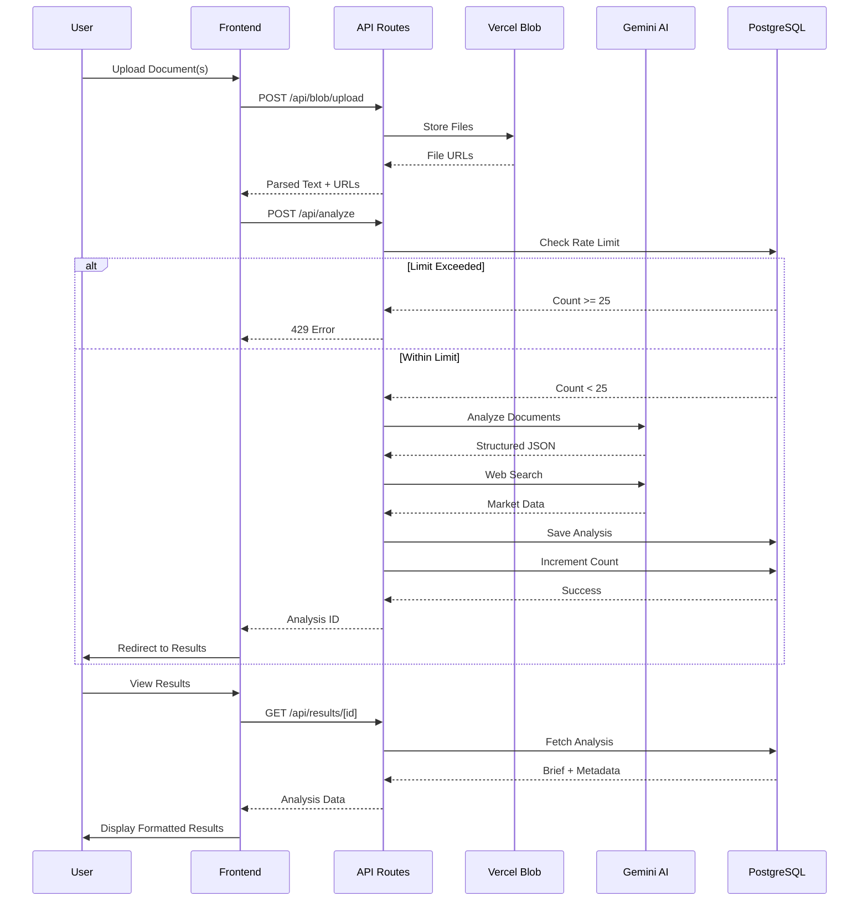
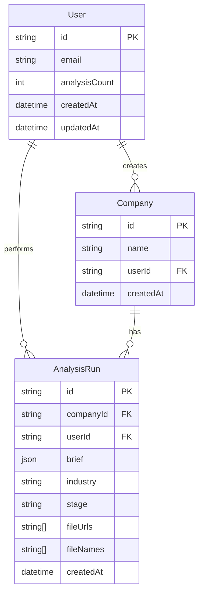
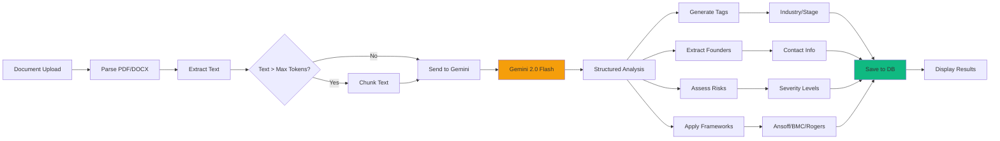
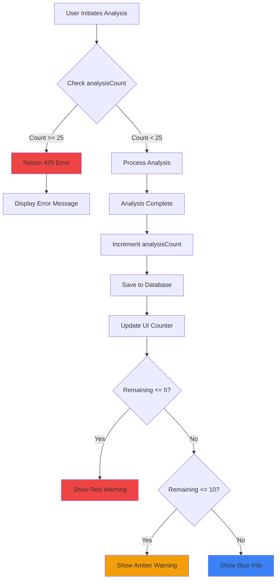
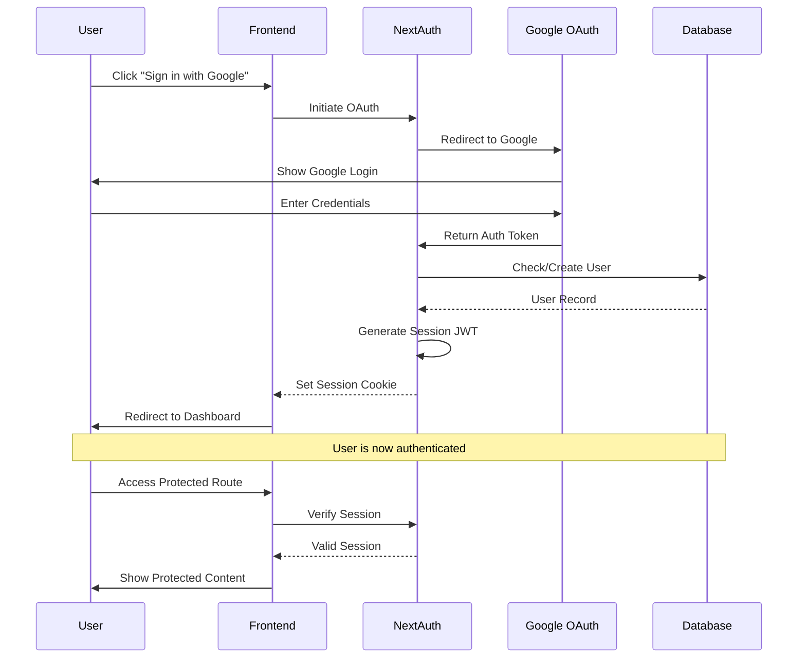
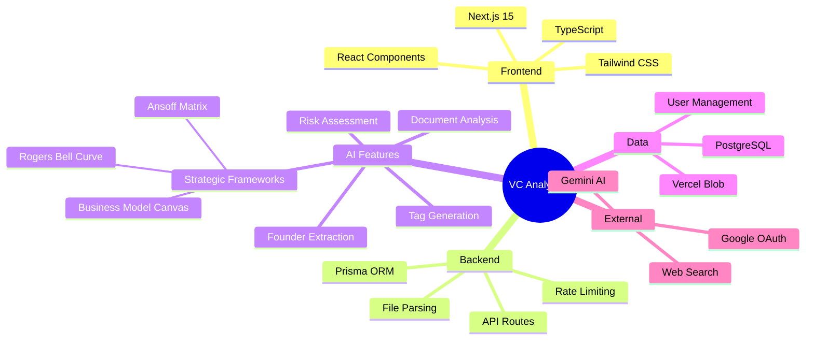

# VC Analyst AI - Mermaid Architecture Diagrams

## High-Level System Architecture

```mermaid
graph TB
    subgraph "Frontend Layer"
        A[Home Page] --> B[Results Page]
        A --> C[History Page]
        D[Components] --> B
        D --> C
        E[Auth UI] --> A
    end

    subgraph "API Layer"
        F[/api/analyze]
        G[/api/results]
        H[/api/web-search]
        I[/api/blob/upload]
        J[/api/user/usage]
        K[/api/history]
    end

    subgraph "Services"
        L[Prisma ORM]
        M[Document Parser]
        N[AI Processor]
        O[Rate Limiter]
    end

    subgraph "Data Layer"
        P[(PostgreSQL)]
        Q[Vercel Blob Storage]
    end

    subgraph "External Services"
        R[Google Gemini AI]
        S[Google OAuth]
    end

    A --> F
    B --> G
    C --> K
    A --> I
    A --> J

    F --> N
    F --> O
    G --> L
    H --> R
    I --> M
    J --> L
    K --> L

    L --> P
    M --> Q
    N --> R
    O --> P

    E --> S

    style A fill:#6366f1
    style B fill:#6366f1
    style C fill:#6366f1
    style D fill:#6366f1
    style E fill:#6366f1
    style F fill:#3b82f6
    style G fill:#3b82f6
    style H fill:#3b82f6
    style I fill:#3b82f6
    style J fill:#3b82f6
    style K fill:#3b82f6
    style L fill:#14b8a6
    style M fill:#14b8a6
    style N fill:#14b8a6
    style O fill:#14b8a6
    style P fill:#10b981
    style Q fill:#10b981
    style R fill:#f59e0b
    style S fill:#f59e0b
```

## Analysis Flow Sequence



## Database Schema Diagram



## AI Processing Pipeline



## Rate Limiting Flow



## Authentication Flow



## Component Hierarchy

```mermaid
graph TD
    A[App Layout] --> B[NavBar]
    A --> C[Home Page]
    A --> D[Results Page]
    A --> E[History Page]

    C --> F[Document Upload]
    C --> G[Analysis Button]
    C --> H[Usage Counter]

    D --> I[One-Liner]
    D --> J[Ratings Gauges]
    D --> K[Analysis Sections]
    D --> L[Strategic Components]
    D --> M[Previous Runs]

    K --> N[Problem/Solution]
    K --> O[Team/Founders]
    K --> P[Contact Info]
    K --> Q[Risks with Severity]

    L --> R[AnsoffMatrix]
    L --> S[BusinessModelCanvas]
    L --> T[RogersBellCurve]

    E --> U[Company List]
    E --> V[Company Detail]

    U --> W[Company Cards]
    U --> X[Industry/Stage Tags]

    style A fill:#1e293b
    style D fill:#6366f1
    style L fill:#8b5cf6
    style R fill:#f59e0b
    style S fill:#f59e0b
    style T fill:#f59e0b
```



## Feature Dependencies



---

## How to Use These Diagrams

### In Markdown/GitHub

Copy the Mermaid code blocks directly into your markdown files. GitHub and many markdown viewers will automatically render them.

### In Presentations

1. Use online tools like [mermaid.live](https://mermaid.live) to render diagrams
2. Export as PNG/SVG
3. Insert into PowerPoint/Google Slides

### In Documentation

Keep these diagrams in your docs folder and reference them in your README or technical documentation.

---

**Note**: The SVG architecture diagram (`architecture-diagram.svg`) is ready for immediate use in presentations!
