```mermaid
%%{init: {'theme':'base', 'themeVariables': { 'primaryColor':'#4285F4', 'primaryTextColor':'#fff', 'primaryBorderColor':'#1a73e8', 'lineColor':'#34a853', 'secondaryColor':'#ea4335', 'tertiaryColor':'#fbbc04'}}}%%
graph LR
    A["📊 1,000+ Pitch Decks<br/>Received Per Year"] --> B["⏱️ 4-6 Hours<br/>Per Analysis"]
    B --> C["📉 Only 1%<br/>Deeply Analyzed"]
    C --> D["⚠️ 99%<br/>Overlooked"]

    style A fill:#4285F4,stroke:#1a73e8,stroke-width:3px,color:#fff
    style B fill:#ea4335,stroke:#c5221f,stroke-width:3px,color:#fff
    style C fill:#fbbc04,stroke:#f9ab00,stroke-width:3px,color:#000
    style D fill:#ea4335,stroke:#c5221f,stroke-width:3px,color:#fff
```

```mermaid
%%{init: {'theme':'base', 'themeVariables': { 'primaryColor':'#4285F4', 'primaryTextColor':'#fff', 'primaryBorderColor':'#1a73e8', 'lineColor':'#34a853', 'secondaryColor':'#ea4335', 'tertiaryColor':'#fbbc04'}}}%%
graph LR
    subgraph Before["❌ Before VC Analyst AI"]
        A["4-6 Hours<br/>Manual Analysis"]
        B["1% Coverage<br/>~10 Startups/Month"]
    end

    subgraph After["✅ After VC Analyst AI"]
        C["2 Minutes<br/>AI Analysis"]
        D["10x Coverage<br/>~100 Startups/Month"]
    end

    Before -->|"95% Time Reduction"| After

    style A fill:#ea4335,stroke:#c5221f,stroke-width:3px,color:#fff
    style B fill:#ea4335,stroke:#c5221f,stroke-width:3px,color:#fff
    style C fill:#34a853,stroke:#137333,stroke-width:3px,color:#fff
    style D fill:#34a853,stroke:#137333,stroke-width:3px,color:#fff
    style Before fill:#fff5f5,stroke:#ea4335,stroke-width:2px
    style After fill:#f0fdf4,stroke:#34a853,stroke-width:2px
```

```mermaid
%%{init: {'theme':'base', 'themeVariables': { 'primaryColor':'#4285F4', 'primaryTextColor':'#fff', 'primaryBorderColor':'#1a73e8', 'lineColor':'#34a853', 'secondaryColor':'#ea4335', 'tertiaryColor':'#fbbc04'}}}%%
graph TB
    subgraph Metrics["📊 Key Impact Metrics"]
        A["⏱️ 95%<br/>Time Reduction"]
        B["📈 10x<br/>More Startups"]
        C["✅ 100%<br/>Structured Output"]
        D["🎯 7 Dimensions<br/>Multi-Rating"]
    end

    style A fill:#34a853,stroke:#137333,stroke-width:3px,color:#fff
    style B fill:#4285F4,stroke:#1a73e8,stroke-width:3px,color:#fff
    style C fill:#fbbc04,stroke:#f9ab00,stroke-width:3px,color:#000
    style D fill:#ea4335,stroke:#c5221f,stroke-width:3px,color:#fff
    style Metrics fill:#f8f9fa,stroke:#4285F4,stroke-width:2px
```

```mermaid
%%{init: {'theme':'base', 'themeVariables': { 'primaryColor':'#4285F4', 'primaryTextColor':'#fff', 'primaryBorderColor':'#1a73e8', 'lineColor':'#34a853', 'secondaryColor':'#ea4335', 'tertiaryColor':'#fbbc04'}}}%%
graph TB
    subgraph Google["🔵 Google Cloud Platform"]
        A["🧠 Vertex AI<br/>Gemini 2.5 Pro<br/>📄 Document Analysis"]
        B["⚡ Vertex AI<br/>Gemini 2.5 Flash Lite<br/>🔍 Web Search"]
        C["🔐 Google OAuth 2.0<br/>🔒 Authentication"]
    end

    A --> D["📊 Structured Analysis"]
    B --> E["📈 Market Intelligence"]
    C --> F["👤 User Management"]

    style A fill:#4285F4,stroke:#1a73e8,stroke-width:3px,color:#fff
    style B fill:#34a853,stroke:#137333,stroke-width:3px,color:#fff
    style C fill:#fbbc04,stroke:#f9ab00,stroke-width:3px,color:#000
    style Google fill:#f8f9fa,stroke:#4285F4,stroke-width:3px
```

# VC Analyst AI - Presentation Infographics

This file contains Mermaid diagrams and SVG designs that you can render and screenshot for your presentation slides.

## How to Use

### For Mermaid Diagrams:

1. Copy the Mermaid code
2. Go to https://mermaid.live or use any Mermaid renderer
3. Paste the code
4. Take a screenshot
5. Add to your slides

### For SVG Designs:

1. Copy the SVG code
2. Save as `.svg` file
3. Open in browser or image editor
4. Export as PNG/JPEG
5. Add to your slides

---

## INFOGRAPHIC 1: Problem - Time vs Coverage Analysis

**Use on: Problem That You Are Solving slide**




---

## INFOGRAPHIC 2: Problem - Funnel Visualization

**Use on: Problem That You Are Solving slide**


---

## INFOGRAPHIC 3: Impact - Time Savings Comparison

**Use on: Impact of the Solution slide**



---

## INFOGRAPHIC 4: Impact - Metrics Dashboard

**Use on: Impact of the Solution slide**



---

## INFOGRAPHIC 5: Solution Flow - How It Works

**Use on: Brief About Your Solution slide**

```mermaid
%%{init: {'theme':'base', 'themeVariables': { 'primaryColor':'#4285F4', 'primaryTextColor':'#fff', 'primaryBorderColor':'#1a73e8', 'lineColor':'#34a853', 'secondaryColor':'#ea4335', 'tertiaryColor':'#fbbc04'}}}%%
flowchart LR
    A["📤 Upload<br/>Documents<br/>PDF/DOCX"] --> B["🤖 AI Analysis<br/>Gemini Pro<br/>1-2 Minutes"]
    B --> C["📊 Generate<br/>Comprehensive<br/>Brief"]
    C --> D["✅ Investor-Ready<br/>Analysis"]

    style A fill:#4285F4,stroke:#1a73e8,stroke-width:3px,color:#fff
    style B fill:#34a853,stroke:#137333,stroke-width:3px,color:#fff
    style C fill:#fbbc04,stroke:#f9ab00,stroke-width:3px,color:#000
    style D fill:#ea4335,stroke:#c5221f,stroke-width:3px,color:#fff
```



---

## INFOGRAPHIC 6: Google Technologies Stack

**Use on: Google Technologies Used and Their Use Cases slide**



---

## INFOGRAPHIC 7: Features Overview

**Use on: Features of the Solution slide**


---

## INFOGRAPHIC 8: Architecture Flow Diagram

**Use on: Architecture Diagram of the Proposed Solution slide**

```mermaid
%%{init: {'theme':'base', 'themeVariables': { 'primaryColor':'#4285F4', 'primaryTextColor':'#fff', 'primaryBorderColor':'#1a73e8', 'lineColor':'#34a853', 'secondaryColor':'#ea4335', 'tertiaryColor':'#fbbc04'}}}%%
flowchart TD
    A["👤 User<br/>Uploads Documents"] --> B["🌐 Next.js Frontend"]
    B --> C["☁️ Vercel Blob<br/>File Storage"]
    C --> D["🔧 API Layer<br/>Document Parser"]
    D --> E["🤖 Vertex AI<br/>Gemini Pro"]
    E --> F["🔍 Gemini Flash Lite<br/>Web Search"]
    F --> G["💾 PostgreSQL<br/>Store Results"]
    G --> H["📊 Results Page<br/>Display Analysis"]

    style A fill:#4285F4,stroke:#1a73e8,stroke-width:3px,color:#fff
    style B fill:#34a853,stroke:#137333,stroke-width:3px,color:#fff
    style C fill:#fbbc04,stroke:#f9ab00,stroke-width:3px,color:#000
    style D fill:#ea4335,stroke:#c5221f,stroke-width:3px,color:#fff
    style E fill:#4285F4,stroke:#1a73e8,stroke-width:4px,color:#fff
    style F fill:#34a853,stroke:#137333,stroke-width:3px,color:#fff
    style G fill:#fbbc04,stroke:#f9ab00,stroke-width:3px,color:#000
    style H fill:#ea4335,stroke:#c5221f,stroke-width:3px,color:#fff
```



---

## INFOGRAPHIC 9: Differentiation Comparison

**Use on: How Is This Solution Different from Others slide**

```mermaid
%%{init: {'theme':'base', 'themeVariables': { 'primaryColor':'#4285F4', 'primaryTextColor':'#fff', 'primaryBorderColor':'#1a73e8', 'lineColor':'#34a853', 'secondaryColor':'#ea4335', 'tertiaryColor':'#fbbc04'}}}%%
graph LR
    subgraph Generic["❌ Generic AI Tools"]
        A["Text Summaries"]
        B["No Frameworks"]
        C["Single Score"]
    end

    subgraph VC["✅ VC Analyst AI"]
        D["VC-Specific Analysis"]
        E["Strategic Frameworks<br/>Ansoff, BMC, Rogers"]
        F["7-Dimensional Ratings"]
    end

    Generic -->|"Purpose-Built"| VC

    style A fill:#ea4335,stroke:#c5221f,stroke-width:2px,color:#fff
    style B fill:#ea4335,stroke:#c5221f,stroke-width:2px,color:#fff
    style C fill:#ea4335,stroke:#c5221f,stroke-width:2px,color:#fff
    style D fill:#34a853,stroke:#137333,stroke-width:3px,color:#fff
    style E fill:#34a853,stroke:#137333,stroke-width:3px,color:#fff
    style F fill:#34a853,stroke:#137333,stroke-width:3px,color:#fff
    style Generic fill:#fff5f5,stroke:#ea4335,stroke-width:2px
    style VC fill:#f0fdf4,stroke:#34a853,stroke-width:2px
```



---

## INFOGRAPHIC 10: Future Roadmap Timeline (Horizontal)

**Use on: Future Scope slide**

```mermaid
%%{init: {'theme':'base', 'themeVariables': { 'primaryColor':'#4285F4', 'primaryTextColor':'#fff', 'primaryBorderColor':'#1a73e8', 'lineColor':'#34a853', 'secondaryColor':'#ea4335', 'tertiaryColor':'#fbbc04'}}}%%
flowchart LR
    subgraph ST["🚀 Short-Term"]
        direction TB
        A1["API Access"]
        A2["Team Collaboration"]
        A3["Enhanced Frameworks"]
    end

    subgraph MT["📈 Medium-Term"]
        direction TB
        B1["Custom AI Training"]
        B2["Financial Analysis"]
        B3["Competitive Mapping"]
    end

    subgraph LT["🌟 Long-Term"]
        direction TB
        C1["Industry Standard"]
        C2["Ecosystem Integration"]
        C3["Predictive Analytics"]
    end

    ST -->|"Next Phase"| MT
    MT -->|"Future Vision"| LT

    style A1 fill:#4285F4,stroke:#1a73e8,stroke-width:2px,color:#fff
    style A2 fill:#4285F4,stroke:#1a73e8,stroke-width:2px,color:#fff
    style A3 fill:#4285F4,stroke:#1a73e8,stroke-width:2px,color:#fff
    style B1 fill:#34a853,stroke:#137333,stroke-width:2px,color:#fff
    style B2 fill:#34a853,stroke:#137333,stroke-width:2px,color:#fff
    style B3 fill:#34a853,stroke:#137333,stroke-width:2px,color:#fff
    style C1 fill:#fbbc04,stroke:#f9ab00,stroke-width:2px,color:#000
    style C2 fill:#fbbc04,stroke:#f9ab00,stroke-width:2px,color:#000
    style C3 fill:#fbbc04,stroke:#f9ab00,stroke-width:2px,color:#000
    style ST fill:#e8f0fe,stroke:#4285F4,stroke-width:3px
    style MT fill:#e6f4ea,stroke:#34a853,stroke-width:3px
    style LT fill:#fef7e0,stroke:#fbbc04,stroke-width:3px
```



**Note:** This horizontal timeline shows the roadmap progression from left to right, perfect for presentation slides. No dates required!

---

## SVG INFOGRAPHIC 1: Time Comparison Bar Chart

**Use on: Impact of the Solution slide**

```svg
<svg width="600" height="400" xmlns="http://www.w3.org/2000/svg">
  <defs>
    <linearGradient id="redGrad" x1="0%" y1="0%" x2="0%" y2="100%">
      <stop offset="0%" style="stop-color:#ea4335;stop-opacity:1" />
      <stop offset="100%" style="stop-color:#c5221f;stop-opacity:1" />
    </linearGradient>
    <linearGradient id="greenGrad" x1="0%" y1="0%" x2="0%" y2="100%">
      <stop offset="0%" style="stop-color:#34a853;stop-opacity:1" />
      <stop offset="100%" style="stop-color:#137333;stop-opacity:1" />
    </linearGradient>
  </defs>

  <!-- Background -->
  <rect width="600" height="400" fill="#f8f9fa"/>

  <!-- Title -->
  <text x="300" y="30" font-family="Arial, sans-serif" font-size="24" font-weight="bold" text-anchor="middle" fill="#202124">
    Time Savings Comparison
  </text>

  <!-- Before Bar -->
  <rect x="100" y="100" width="200" height="250" fill="url(#redGrad)" rx="5"/>
  <text x="200" y="370" font-family="Arial, sans-serif" font-size="16" font-weight="bold" text-anchor="middle" fill="#202124">
    Before: 4-6 Hours
  </text>
  <text x="200" y="390" font-family="Arial, sans-serif" font-size="14" text-anchor="middle" fill="#5f6368">
    Manual Analysis
  </text>

  <!-- After Bar -->
  <rect x="350" y="320" width="200" height="30" fill="url(#greenGrad)" rx="5"/>
  <text x="450" y="370" font-family="Arial, sans-serif" font-size="16" font-weight="bold" text-anchor="middle" fill="#202124">
    After: 2 Minutes
  </text>
  <text x="450" y="390" font-family="Arial, sans-serif" font-size="14" text-anchor="middle" fill="#5f6368">
    AI-Powered
  </text>

  <!-- Percentage -->
  <text x="300" y="280" font-family="Arial, sans-serif" font-size="32" font-weight="bold" text-anchor="middle" fill="#34a853">
    95% Time Reduction
  </text>

  <!-- Arrow -->
  <path d="M 200 200 L 350 200" stroke="#4285F4" stroke-width="4" fill="none" marker-end="url(#arrowhead)"/>
  <defs>
    <marker id="arrowhead" markerWidth="10" markerHeight="10" refX="9" refY="3" orient="auto">
      <polygon points="0 0, 10 3, 0 6" fill="#4285F4"/>
    </marker>
  </defs>
</svg>
```

---

## SVG INFOGRAPHIC 2: Coverage Funnel

**Use on: Problem That You Are Solving slide**

```svg
<svg width="500" height="600" xmlns="http://www.w3.org/2000/svg">
  <defs>
    <linearGradient id="blueGrad" x1="0%" y1="0%" x2="0%" y2="100%">
      <stop offset="0%" style="stop-color:#4285F4;stop-opacity:1" />
      <stop offset="100%" style="stop-color:#1a73e8;stop-opacity:1" />
    </linearGradient>
    <linearGradient id="redGrad" x1="0%" y1="0%" x2="0%" y2="100%">
      <stop offset="0%" style="stop-color:#ea4335;stop-opacity:1" />
      <stop offset="100%" style="stop-color:#c5221f;stop-opacity:1" />
    </linearGradient>
  </defs>

  <!-- Background -->
  <rect width="500" height="600" fill="#ffffff"/>

  <!-- Title -->
  <text x="250" y="30" font-family="Arial, sans-serif" font-size="22" font-weight="bold" text-anchor="middle" fill="#202124">
    VC Analysis Funnel
  </text>

  <!-- Funnel Levels -->
  <!-- Level 1 -->
  <rect x="50" y="80" width="400" height="80" fill="url(#blueGrad)" rx="5"/>
  <text x="250" y="125" font-family="Arial, sans-serif" font-size="20" font-weight="bold" text-anchor="middle" fill="#ffffff">
    1,000+ Pitch Decks Received
  </text>

  <!-- Level 2 -->
  <rect x="100" y="180" width="300" height="60" fill="#34a853" rx="5"/>
  <text x="250" y="215" font-family="Arial, sans-serif" font-size="18" font-weight="bold" text-anchor="middle" fill="#ffffff">
    ~500 Initial Review
  </text>

  <!-- Level 3 -->
  <rect x="150" y="260" width="200" height="50" fill="#fbbc04" rx="5"/>
  <text x="250" y="290" font-family="Arial, sans-serif" font-size="16" font-weight="bold" text-anchor="middle" fill="#000000">
    ~100 Detailed Review
  </text>

  <!-- Level 4 -->
  <rect x="200" y="330" width="100" height="40" fill="url(#redGrad)" rx="5"/>
  <text x="250" y="355" font-family="Arial, sans-serif" font-size="14" font-weight="bold" text-anchor="middle" fill="#ffffff">
    ~10 Deep Analysis
  </text>

  <!-- Level 5 -->
  <rect x="225" y="390" width="50" height="30" fill="url(#redGrad)" rx="5"/>
  <text x="250" y="410" font-family="Arial, sans-serif" font-size="12" font-weight="bold" text-anchor="middle" fill="#ffffff">
    1-2 Investments
  </text>

  <!-- Bottom Text -->
  <text x="250" y="470" font-family="Arial, sans-serif" font-size="16" font-weight="bold" text-anchor="middle" fill="#ea4335">
    Only 1% Get Deep Analysis
  </text>
  <text x="250" y="495" font-family="Arial, sans-serif" font-size="14" text-anchor="middle" fill="#5f6368">
    99% of startups are overlooked
  </text>
</svg>
```

---

## SVG INFOGRAPHIC 3: Technology Stack

**Use on: Google Technologies Used and Their Use Cases slide**

```svg
<svg width="700" height="400" xmlns="http://www.w3.org/2000/svg">
  <defs>
    <linearGradient id="blueGrad" x1="0%" y1="0%" x2="0%" y2="100%">
      <stop offset="0%" style="stop-color:#4285F4;stop-opacity:1" />
      <stop offset="100%" style="stop-color:#1a73e8;stop-opacity:1" />
    </linearGradient>
    <linearGradient id="greenGrad" x1="0%" y1="0%" x2="0%" y2="100%">
      <stop offset="0%" style="stop-color:#34a853;stop-opacity:1" />
      <stop offset="100%" style="stop-color:#137333;stop-opacity:1" />
    </linearGradient>
    <linearGradient id="yellowGrad" x1="0%" y1="0%" x2="0%" y2="100%">
      <stop offset="0%" style="stop-color:#fbbc04;stop-opacity:1" />
      <stop offset="100%" style="stop-color:#f9ab00;stop-opacity:1" />
    </linearGradient>
  </defs>

  <!-- Background -->
  <rect width="700" height="400" fill="#f8f9fa"/>

  <!-- Title -->
  <text x="350" y="30" font-family="Arial, sans-serif" font-size="24" font-weight="bold" text-anchor="middle" fill="#202124">
    Google Technologies Powering VC Analyst AI
  </text>

  <!-- Gemini Pro Card -->
  <rect x="50" y="80" width="180" height="280" fill="url(#blueGrad)" rx="10"/>
  <text x="140" y="110" font-family="Arial, sans-serif" font-size="18" font-weight="bold" text-anchor="middle" fill="#ffffff">
    Gemini 2.5 Pro
  </text>
  <text x="140" y="135" font-family="Arial, sans-serif" font-size="14" text-anchor="middle" fill="#ffffff">
    Vertex AI
  </text>
  <text x="140" y="180" font-family="Arial, sans-serif" font-size="12" text-anchor="middle" fill="#ffffff">
    📄 Document Analysis
  </text>
  <text x="140" y="200" font-family="Arial, sans-serif" font-size="12" text-anchor="middle" fill="#ffffff">
    📊 Structured Extraction
  </text>
  <text x="140" y="220" font-family="Arial, sans-serif" font-size="12" text-anchor="middle" fill="#ffffff">
    🎯 Strategic Frameworks
  </text>

  <!-- Gemini Flash Lite Card -->
  <rect x="260" y="80" width="180" height="280" fill="url(#greenGrad)" rx="10"/>
  <text x="350" y="110" font-family="Arial, sans-serif" font-size="18" font-weight="bold" text-anchor="middle" fill="#ffffff">
    Gemini 2.5
  </text>
  <text x="350" y="130" font-family="Arial, sans-serif" font-size="18" font-weight="bold" text-anchor="middle" fill="#ffffff">
    Flash Lite
  </text>
  <text x="350" y="155" font-family="Arial, sans-serif" font-size="14" text-anchor="middle" fill="#ffffff">
    Vertex AI
  </text>
  <text x="350" y="200" font-family="Arial, sans-serif" font-size="12" text-anchor="middle" fill="#ffffff">
    🔍 Web Search
  </text>
  <text x="350" y="220" font-family="Arial, sans-serif" font-size="12" text-anchor="middle" fill="#ffffff">
    📈 Market Research
  </text>
  <text x="350" y="240" font-family="Arial, sans-serif" font-size="12" text-anchor="middle" fill="#ffffff">
    ⚡ Real-time Data
  </text>

  <!-- OAuth Card -->
  <rect x="470" y="80" width="180" height="280" fill="url(#yellowGrad)" rx="10"/>
  <text x="560" y="110" font-family="Arial, sans-serif" font-size="18" font-weight="bold" text-anchor="middle" fill="#000000">
    Google OAuth 2.0
  </text>
  <text x="560" y="135" font-family="Arial, sans-serif" font-size="14" text-anchor="middle" fill="#000000">
    Authentication
  </text>
  <text x="560" y="180" font-family="Arial, sans-serif" font-size="12" text-anchor="middle" fill="#000000">
    🔐 Secure Login
  </text>
  <text x="560" y="200" font-family="Arial, sans-serif" font-size="12" text-anchor="middle" fill="#000000">
    👤 User Management
  </text>
  <text x="560" y="220" font-family="Arial, sans-serif" font-size="12" text-anchor="middle" fill="#000000">
    🛡️ Enterprise Security
  </text>
</svg>
```

---

## SVG INFOGRAPHIC 4: Features Icons

**Use on: Features of the Solution slide**

```svg
<svg width="800" height="300" xmlns="http://www.w3.org/2000/svg">
  <!-- Background -->
  <rect width="800" height="300" fill="#ffffff"/>

  <!-- Title -->
  <text x="400" y="30" font-family="Arial, sans-serif" font-size="22" font-weight="bold" text-anchor="middle" fill="#202124">
    Key Features
  </text>

  <!-- Feature 1 -->
  <circle cx="100" cy="120" r="40" fill="#4285F4"/>
  <text x="100" y="130" font-family="Arial, sans-serif" font-size="32" text-anchor="middle" fill="#ffffff">📊</text>
  <text x="100" y="180" font-family="Arial, sans-serif" font-size="12" font-weight="bold" text-anchor="middle" fill="#202124">
    Comprehensive
  </text>
  <text x="100" y="195" font-family="Arial, sans-serif" font-size="12" text-anchor="middle" fill="#202124">
    Analysis
  </text>

  <!-- Feature 2 -->
  <circle cx="240" cy="120" r="40" fill="#34a853"/>
  <text x="240" y="130" font-family="Arial, sans-serif" font-size="32" text-anchor="middle" fill="#ffffff">📐</text>
  <text x="240" y="180" font-family="Arial, sans-serif" font-size="12" font-weight="bold" text-anchor="middle" fill="#202124">
    Strategic
  </text>
  <text x="240" y="195" font-family="Arial, sans-serif" font-size="12" text-anchor="middle" fill="#202124">
    Frameworks
  </text>

  <!-- Feature 3 -->
  <circle cx="380" cy="120" r="40" fill="#fbbc04"/>
  <text x="380" y="130" font-family="Arial, sans-serif" font-size="32" text-anchor="middle" fill="#ffffff">⭐</text>
  <text x="380" y="180" font-family="Arial, sans-serif" font-size="12" font-weight="bold" text-anchor="middle" fill="#202124">
    Multi-Dimensional
  </text>
  <text x="380" y="195" font-family="Arial, sans-serif" font-size="12" text-anchor="middle" fill="#202124">
    Ratings
  </text>

  <!-- Feature 4 -->
  <circle cx="520" cy="120" r="40" fill="#ea4335"/>
  <text x="520" y="130" font-family="Arial, sans-serif" font-size="32" text-anchor="middle" fill="#ffffff">⚠️</text>
  <text x="520" y="180" font-family="Arial, sans-serif" font-size="12" font-weight="bold" text-anchor="middle" fill="#202124">
    Risk
  </text>
  <text x="520" y="195" font-family="Arial, sans-serif" font-size="12" text-anchor="middle" fill="#202124">
    Assessment
  </text>

  <!-- Feature 5 -->
  <circle cx="660" cy="120" r="40" fill="#9c27b0"/>
  <text x="660" y="130" font-family="Arial, sans-serif" font-size="32" text-anchor="middle" fill="#ffffff">💬</text>
  <text x="660" y="180" font-family="Arial, sans-serif" font-size="12" font-weight="bold" text-anchor="middle" fill="#202124">
    Interactive
  </text>
  <text x="660" y="195" font-family="Arial, sans-serif" font-size="12" text-anchor="middle" fill="#202124">
    Q&A
  </text>
</svg>
```

---

## Quick Reference: Which Infographic for Which Slide

| Slide                            | Recommended Infographics                                                                     |
| -------------------------------- | -------------------------------------------------------------------------------------------- |
| **Problem That You Are Solving** | INFOGRAPHIC 2 (Funnel), SVG INFOGRAPHIC 2 (Coverage Funnel)                                  |
| **Brief About Your Solution**    | INFOGRAPHIC 5 (Solution Flow)                                                                |
| **Google Technologies Used**     | INFOGRAPHIC 6 (Tech Stack), SVG INFOGRAPHIC 3 (Technology Stack)                             |
| **Features of the Solution**     | INFOGRAPHIC 7 (Features Overview), SVG INFOGRAPHIC 4 (Features Icons)                        |
| **Impact of the Solution**       | INFOGRAPHIC 3 (Time Comparison), INFOGRAPHIC 4 (Metrics), SVG INFOGRAPHIC 1 (Time Bar Chart) |
| **Architecture Diagram**         | INFOGRAPHIC 8 (Architecture Flow)                                                            |
| **How Different from Others**    | INFOGRAPHIC 9 (Differentiation Comparison)                                                   |
| **Future Scope**                 | INFOGRAPHIC 10 (Roadmap Timeline)                                                            |

---

## Tips for Using These Infographics

1. **Mermaid Diagrams**:

   - Visit https://mermaid.live
   - Paste the code
   - Adjust colors if needed
   - Export as PNG or take screenshot

2. **SVG Files**:

   - Save as `.svg` file
   - Open in browser (Chrome, Firefox)
   - Right-click → Inspect → Adjust size if needed
   - Take screenshot or use browser's print to PDF

3. **Customization**:

   - Edit colors to match your brand
   - Adjust text sizes for readability
   - Modify dimensions for your slide format

4. **Best Practices**:
   - Use 1-2 infographics per slide maximum
   - Ensure text is readable at presentation size
   - Keep consistent color scheme (Google colors)
   - Test on actual slide before presentation

---

**Created for Google AI Hackathon 2025**
**Powered by Google Gemini AI via Vertex AI**
